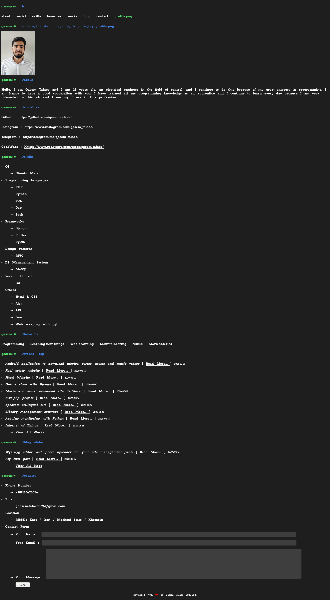
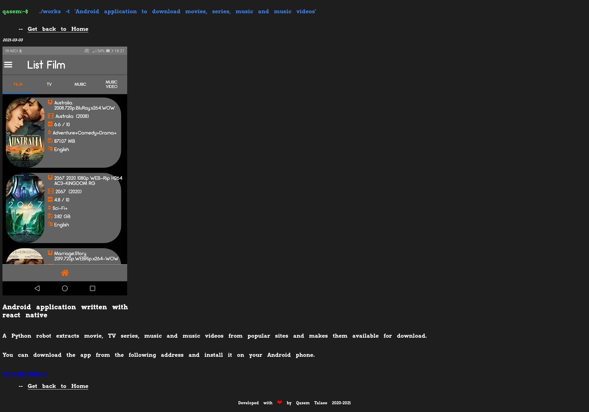
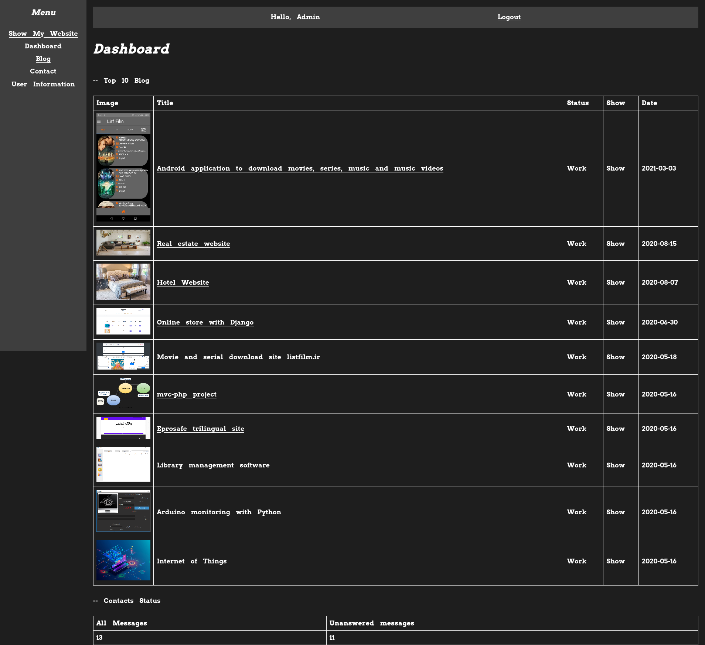
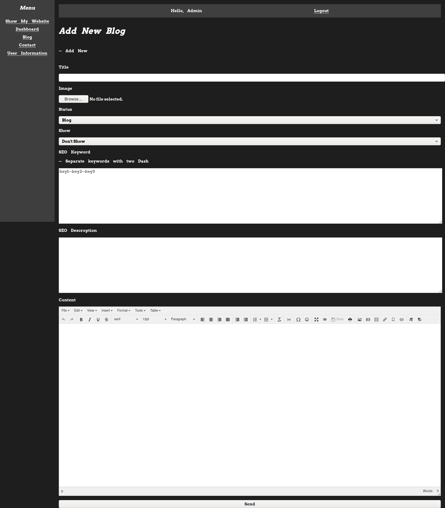

# Portfolio website for Programmers
This website programmed with PHP and Mysql and has admin part.

See Demo : [http://qtle.ir](http://qtle.ir)

After installing, Change database information in these two files:

```
/includes/db.php
/myadmin/includes/db.php
```

Login with these informations:

```
Email : admin@gmail.com
Pass  : admin
```

See some Screenshots:
### Home page

### Blog detail page

### Admin Dashboard page

### Add new blog page
